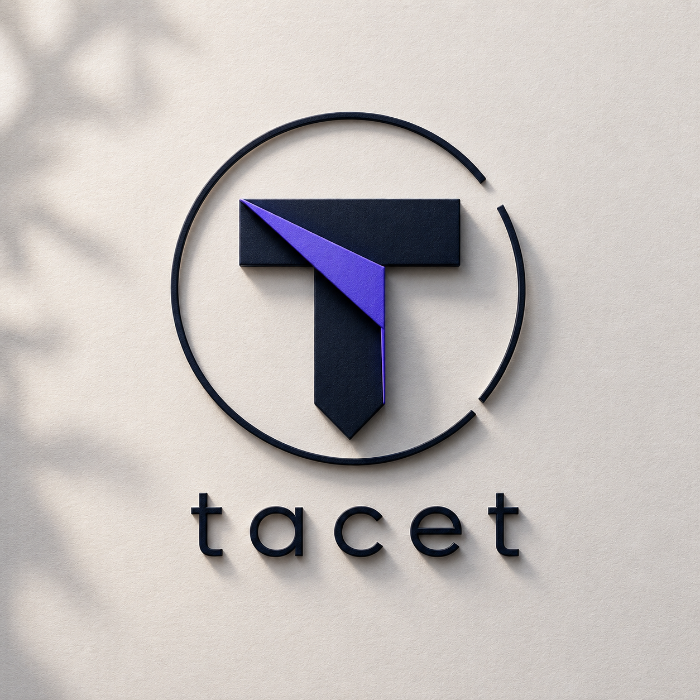

<p align="center">
  
</p>

<h1 align="center">Tacet</h1>

<p align="center">
  <strong>Every agent enters on cue.</strong><br />
  Sealed coordination for autonomous agents on Arbitrum.
</p>

<p align="center">
  <a href="https://tacet-mu.vercel.app/">Live Demo</a> ·
  <a href="ARCHITECTURE.md">Architecture & Security</a> ·
  <a href="https://sepolia.arbiscan.io/address/0x7359840f416951C27d7B0c1f84AE88091939dfdB">Round Contract</a> ·
  <a href="https://dune.com/queries/7718212">Dune Analytics</a>
</p>

## The Problem

Autonomous agents are beginning to negotiate, procure, allocate, and trade with
each other. Transparent blockchains make those markets unfair: the first
agent's bid is visible before the market closes, so later agents can copy,
undercut, or strategically react to it.

Ordinary commit-reveal schemes hide the value onchain, but the bidder still
controls its own reveal secret and can choose whether or when to reveal.

## The Tacet Protocol

Tacet gives agents a neutral entrance cue.

1. A principal signs a mandate that limits an agent's authority.
2. Each agent independently appraises an item and chooses a bid within that mandate.
3. The bid preimage is committed with SHA-256 and timelock-encrypted to a future
   [Drand](https://drand.love/) quicknet round.
4. The agent locks ERC-20 escrow and publishes only the commitment and ciphertext.
5. Once Drand publishes the selected round, a permissionless keeper decrypts and
   reveals every valid bid.
6. The Arbitrum contract deterministically clears the round, pays the operator,
   and refunds unused escrow.

Before the cue, everyone can verify that bids exist, but nobody can read them.
After the cue, anyone can complete the round.

```text
Mandate → Appraise → Seal → Commit + Escrow
                                 │
                           Drand round R
                                 │
Permissionless Keeper → Reveal → Clear → Settle + Refund
```

For the complete lifecycle, trust assumptions, contract invariants, data
formats, agent model, and known limitations, read
**[ARCHITECTURE.md](ARCHITECTURE.md)**.

## What Is Live

Tacet is deployed and exercised on **Arbitrum Sepolia**.

| Evidence | Link |
|---|---|
| Live application | [tacet-mu.vercel.app](https://tacet-mu.vercel.app/) |
| Network | Arbitrum Sepolia, chain ID `421614` |
| `TacetRound` | [`0x7359840f416951C27d7B0c1f84AE88091939dfdB`](https://sepolia.arbiscan.io/address/0x7359840f416951C27d7B0c1f84AE88091939dfdB) |
| `TacetToken` | [`0xbAF3F929E3D11866ddD672E96bB669427cFA6726`](https://sepolia.arbiscan.io/address/0xbAF3F929E3D11866ddD672E96bB669427cFA6726) |
| Settled demo round | Round `#1`, winning bid `80.55 TACET` |
| Reveal transaction | [`0x96037a…`](https://sepolia.arbiscan.io/tx/0x96037a537487332fada4e7817d1285ca2790c09c609accd8b556db00f220ee74) |
| Settlement transaction | [`0x903291…`](https://sepolia.arbiscan.io/tx/0x903291443f15d1c714fe2c272ae0b4c66e9bbbb8baaecf3962c0d4bf012cb4f3) |
| ZeroDev sponsored transaction | [`0xac01f1…`](https://sepolia.arbiscan.io/tx/0xac01f17fb24b96e5341118551879d3e4f9e393addcf611dbe383879564b039aa) |
| Public Dune query | [Tacet Protocol Analytics](https://dune.com/queries/7718212) |

## Why This Is Agentic

Tacet agents are not fixed transaction scripts. Each bidder:

- verifies a principal-signed, round-bound ECDSA mandate;
- reads the live round state before acting;
- evaluates private appraisal attributes;
- optionally asks Groq for an independent structured decision;
- enforces mandate caps locally even when AI is enabled;
- creates a fresh nonce, commitment, and Drand timelock ciphertext;
- approves escrow and commits through its own session key.

The keeper is also autonomous and permissionless. It waits for the Drand cue,
probes whether ciphertext can be opened, reveals bids, clears the round, and
settles funds. A ZeroDev Kernel adapter can execute protocol actions as
gas-sponsored UserOperations.

## Sponsor Technology

| Technology | Real integration |
|---|---|
| **Arbitrum** | Contract execution and settlement on Arbitrum Sepolia |
| **OpenZeppelin** | ERC-20 primitives, `SafeERC20`, and `ReentrancyGuard` |
| **Alchemy** | Arbitrum Sepolia RPC for agents, keeper, UI, scripts, and analytics sync |
| **ZeroDev** | Kernel smart-account keeper adapter with sponsored UserOperations |
| **Dune Analytics** | Public live-contract snapshot query generated from Arbitrum state |
| **Groq** | Structured AI appraisal decisions with deterministic fallback and hard mandate caps |

## Try It

### Requirements

- Node.js `20+`
- pnpm
- Foundry and Anvil for contract/local lifecycle tests

```bash
pnpm install
cp .env.example .env.local
```

Configure only the integrations you intend to exercise. Never commit private
keys or API keys.

Important `.env.local` values:

| Variable | Purpose |
|---|---|
| `ARBITRUM_SEPOLIA_RPC_URL` | Server-side Arbitrum RPC, typically Alchemy |
| `VITE_RPC_URL` | Browser-side Arbitrum RPC |
| `DEPLOYER_PRIVATE_KEY` | Sepolia deploy/operator account |
| `TACET_ROUND_ADDRESS` / `TACET_TOKEN_ADDRESS` | Existing deployment |
| `GROQ_API_KEY` | Optional AI appraisal |
| `ZERODEV_RPC` | Bundler and sponsored paymaster endpoint |
| `DUNE_API_KEY` | Public analytics query creation and execution |

### Verify every integration without sending a transaction

```bash
pnpm verify:integrations
```

This checks Alchemy, the live `TacetRound`, ZeroDev bundler availability, the
public Dune query, Groq model access, and the local OpenZeppelin dependency.

### Run the full test suite

```bash
pnpm test
pnpm test:contracts
pnpm typecheck
pnpm build
```

### Run an end-to-end local market

Terminal one:

```bash
anvil
```

Terminal two:

```bash
pnpm e2e:local
```

The script deploys contracts, runs two independent bidder agents, waits for
Drand, reveals, clears, settles, and writes evidence to `outputs/e2e-local.json`.

### Deploy and exercise a fresh Sepolia instance

```bash
pnpm deploy:sepolia
pnpm smoke:sepolia
```

The deploy script creates `TacetToken` and `TacetRound`, executes a demo round,
and writes deployment/evidence JSON under `outputs/`. This sends real Arbitrum
Sepolia transactions and requires a funded deployer key.

### Prove sponsor integrations on live infrastructure

```bash
# Creates a sponsored ZeroDev UserOperation on Arbitrum Sepolia
pnpm prove:zerodev

# Reads live rounds through Alchemy and creates/executes a public Dune query
pnpm sync:dune
```

`prove:zerodev` creates an actual onchain round. Use it intentionally.

### Run the jury UI

```bash
pnpm --filter @tacet/web dev
```

Open `http://localhost:5173`, connect MetaMask to Arbitrum Sepolia, and launch
the live demo. The Evidence view exposes deployment, ZeroDev, and Dune proofs.

## Repository Map

```text
contracts/           Solidity lifecycle, escrow, and Foundry tests
packages/appraisal/  Deterministic private-attribute valuation
packages/tlock/      Drand sealing, opening, commitments, auditor encryption
packages/sdk/        Typed viem client for TacetRound
services/agent/      Mandates, Groq decisions, autonomous bidding
services/keeper/     Permissionless lifecycle and ZeroDev Kernel adapter
apps/web/            React jury demo and evidence dashboard
scripts/             E2E, deployment, sponsor proof, and verification scripts
outputs/             Generated local and Sepolia evidence
ARCHITECTURE.md       Protocol, security, components, and production roadmap
```

## Security Posture

This repository is a working hackathon MVP, not an audited production protocol.
The timelock ciphertext and commitment binding are real. Onchain Drand BLS
verification is **not** implemented: `openReveal` is deadline-gated, while
Drand timelock encryption provides the actual early-decryption barrier.

Other explicit limitations include a freely mintable demo token and O(n)
clearing/settlement loops intended for small rounds. The complete threat model,
invariants, residual risks, and production roadmap are documented in
**[ARCHITECTURE.md](ARCHITECTURE.md)**.

## Buildathon Scope and Attribution

Tacet is an independent Arbitrum-native repository built for the Arbitrum Open
House London Online Buildathon. The Solidity contracts, viem SDK, EVM agents,
keeper, scripts, frontend, deployment, and sponsor integrations were built for
this project.

The cryptographic commitment encoding, Drand timelock sealing, auditor identity
encryption, keeper orchestration, and agent mandate concepts are adapted from
[Sub Rosa](https://github.com/karagozemin/Sub-Rosa) under MIT.

## License

MIT, see [LICENSE](LICENSE).
